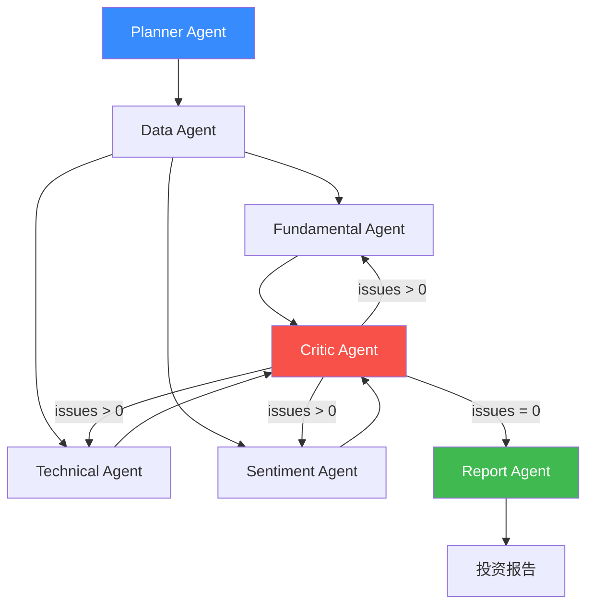
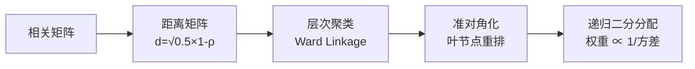

# QuantMind 方法论详解

> 本文档详细阐述 QuantMind 核心技术原理，面向希望理解实现细节的读者。

---

## 目录

1. [Point-in-Time 原则](#1-point-in-time-原则)
2. [Multi-Agent 研究架构](#2-multi-agent-研究架构)
3. [生成式量化选股（LLM Rerank）](#3-生成式量化选股llm-rerank)
4. [DPO 偏好对齐](#4-dpo-偏好对齐)
5. [回测严格性保证](#5-回测严格性保证)
6. [风险与组合管理](#6-风险与组合管理)
7. [知识库与 RAG](#7-知识库与-rag)

---

## 1. Point-in-Time 原则

### 动机

"未来函数"（look-ahead bias）是量化研究中最隐蔽的错误来源。例如，2023Q3 的财报通常在 10-11 月才公告，若在回测中 7 月就能"看到"该数据，会产生严重的虚假 alpha。

### 实现

**财报日期**：使用 tushare `f_ann_date`（实际公告日）而非 `end_date`（报告期）。

```python
# 错误做法（常见于教程）
df = fin_df[fin_df['end_date'] <= as_of]

# 正确做法（PIT 严格）
df = fin_df[fin_df['f_ann_date'] <= as_of]
```

**历史成分股**：不使用当前 CSI 300 成分股，通过 tushare `index_weight` 接口获取历史各时点真实成分（消除幸存者偏差）。

**知识库**：文档向量索引存储 `date` 字段，检索时强制过滤 `doc.date <= as_of`，禁止 Agent 看到未来研报。

**PIT 测试套件**：`tests/test_pit_correctness.py` 包含 10+ 个专项测试 case，验证各数据源的时序边界。

---

## 2. Multi-Agent 研究架构

### 系统结构



### 各 Agent 职责

| Agent | 核心工具 | 输出 |
|---|---|---|
| **Planner** | — | 分析计划（维度、优先级） |
| **Data** | `DataProvider.get_*` | 原始行情/财务数据 |
| **Fundamental** | DCF、财务比率分析 | 基本面评分 + 关键指标 |
| **Technical** | MA/MACD/RSI/布林带 | 技术信号 + 趋势判断 |
| **Sentiment** | 北向资金 + 新闻情绪 | 情绪评分 + 催化剂 |
| **Critic** | Issue 检测规则 | issues 列表（critical/major/minor）|
| **Report** | 综合以上 | 完整投资报告 JSON |

### Self-Reflection 循环

```python
while iteration < max_iterations:
    results = run_analysts(state)
    issues = critic.evaluate(results)
    if not issues:
        break
    state = refine_with_feedback(state, issues)
    iteration += 1
```

Critic 检测维度：数据新鲜度、逻辑一致性、置信度校准、关键指标缺失。

---

## 3. 生成式量化选股（LLM Rerank）

### 三阶段 Pipeline

```
Step 1: LightGBM 粗排（Top-N）
         ↓ 41 个因子 → LambdaRank → score_i
         ↓ 取 Top-50
Step 2: LLM Listwise Rerank
         ↓ 将 Top-50 股票摘要输入 LLM
         ↓ Prompt: "按投资价值从高到低重新排序以下股票..."
         ↓ 解析输出得到新排名
Step 3: DPO 对齐后的 Qwen（可选替换 Step 2）
         ↓ 使用经 DPO 微调的模型
```

### LightGBM 因子列表（41 个）

| 类别 | 因子 |
|---|---|
| 价值 | `pe_ttm`, `pb_ratio`, `earnings_yield`, `book_to_market` |
| 质量 | `roe_ttm`, `gross_margin`, `revenue_growth_yoy`, `net_profit_growth_yoy` |
| 技术动量 | `momentum_20d`, `momentum_60d`, `rsi_14`, `macd_signal` |
| 流动性 | `volume_ratio_5d`, `turnover_rate_20d`, `illiquidity_amihud` |
| 风险 | `beta_60d`, `idiosyncratic_vol_20d`, `max_drawdown_20d`, `skewness_20d` |
| 情绪 | `north_bound_net_flow_5d`, `analyst_coverage`, `analyst_revision` |
| … | 共 41 个，见 `quantmind/features/` |

### IC 分析结果

Phase 2.2 跨 A 股多个市场状态（牛/熊/震荡）的 IC 检验：
- 牛市（2019-2021）：`north_bound_net_flow_5d` IC=0.03，`pe_ttm` IC=0.04
- 熊市（2022）：动量因子 IC 反转为负，价值因子 IC 相对稳定
- 严格阈值（|IC|>0.02）下筛选出 3 个稳定因子

---

## 4. DPO 偏好对齐

### 核心思想

标准 SFT 让模型模仿"好的分析"，但无法区分"合理增持"与"过度乐观的买入"。DPO（Direct Preference Optimization）通过成对偏好数据（`chosen` vs `rejected`）直接优化模型。

### DPO 损失函数

$$\mathcal{L}_{\text{DPO}} = -\mathbb{E}_{(x,y_w,y_l)} \left[\log \sigma\left(\beta \cdot \log\frac{\pi_\theta(y_w|x)}{\pi_{\text{ref}}(y_w|x)} - \beta \cdot \log\frac{\pi_\theta(y_l|x)}{\pi_{\text{ref}}(y_l|x)}\right)\right]$$

- $y_w$：preferred（分析更严谨、逻辑更完整）
- $y_l$：rejected（过于乐观、忽视风险）
- $\beta=0.1$：KL 约束强度

### 实现细节

```python
# 4-bit QLoRA 配置
bnb_config = BitsAndBytesConfig(
    load_in_4bit=True,
    bnb_4bit_quant_type="nf4",
    bnb_4bit_compute_dtype=torch.bfloat16,
)

# LoRA 配置
lora_config = LoraConfig(
    r=16, lora_alpha=32,
    target_modules=["q_proj", "v_proj"],
    lora_dropout=0.05,
)

# DPO 训练器
trainer = DPOTrainer(
    model=model,
    ref_model=ref_model,
    args=DPOConfig(
        beta=0.1,
        max_length=512,        # 防 OOM
        truncation_mode="keep_start",
        gradient_checkpointing=True,
    ),
    train_dataset=dataset,
)
```

**关键工程决策**：`max_length=512` + `gradient_checkpointing=True` 将显存占用从 ~22GB 降至 ~8GB，使单卡 RTX 3080 可训练。

---

## 5. 回测严格性保证

### A 股特殊规则实现

| 规则 | 实现 |
|---|---|
| T+1 | 今日买入信号 → 明日才可卖出 |
| 涨跌停（±9.95%）| `(close - prev_close) / prev_close >= 0.0995` → 不可买入 |
| 停牌 | `volume == 0` → 跳过当日所有操作 |
| 科创板（±20%）| 通过 ticker 后缀 `68xxxx.SH` 自动切换阈值 |

### Walk-Forward 交叉验证

```
时间轴：|--训练--|--验证--|--训练--|--验证--|...
            不重叠，严格时序
```

- `training_window=504` 个交易日（2 年）
- `validation_window=63` 个交易日（1 季度）
- `step_size=21` 天（月度滚动）

### Deflated Sharpe Ratio（DSR）

传统 Sharpe 在多重假设检验下膨胀。DSR 修正了以下偏差：
- **多重比较**：经历过 N 个策略变体
- **非正态**：真实收益有偏度、超额峰度
- **自相关**：月度收益非 IID

$$\text{DSR} = \Phi\left(\frac{SR^* - \hat{\sigma}_{SR} \cdot E[\max_{N}(\mathcal{N})]}{\hat{\sigma}_{SR}}\right)$$

其中：
- $\hat{\sigma}_{SR} = \sqrt{\frac{1 + \frac{1}{2}SR^2 - \gamma_3 SR + \frac{\gamma_4 - 3}{4}SR^2}{T-1}}$
- $E[\max_{N}(\mathcal{N})] \approx (1 - \gamma) Z^{-1}(1 - 1/N) + \gamma Z^{-1}(1 - 1/(Ne))$

---

## 6. 风险与组合管理

### Barra 因子风险模型

$$\sigma_p^2 = w^\top \underbrace{(BFB^\top + \Delta)}_{\text{协方差矩阵}} w$$

- $B$：因子暴露矩阵（股票 × 因子）
- $F$：因子协方差矩阵（时序估计）
- $\Delta$：对角特异性风险矩阵

因子收益截面 OLS：$f_t = (B_t^\top B_t)^{-1} B_t^\top r_t$

### 仓位方法比较

| 方法 | 特点 | 适用场景 |
|---|---|---|
| 等权 | 简单基准 | 无 alpha 信号时 |
| 反向波动率 | $w_i \propto 1/\sigma_i$ | 波动率差异大 |
| 最小方差 | $\min w^\top \Sigma w$ | 低波动目标 |
| 风险平价 | $RC_i = RC_j \;\forall i,j$ | 均衡风险贡献 |
| HRP | 层次聚类 + 递归二分 | 高维、相关矩阵不稳定 |
| Kelly | $w^* = \Sigma^{-1}\mu$（半 Kelly）| 有 alpha 置信度时 |

### HRP 算法



### 回撤控制规则

| 回撤深度 | 目标仓位 |
|---|---|
| > 10% | 70% |
| > 20% | 40% |
| > 30% | 0%（强制清仓） |

CPPI 动态保本：$\text{Exposure} = m \times (\text{NAV} - \text{Floor})$，乘数 $m=3$。

---

## 7. 知识库与 RAG

### 混合检索架构

```
Query
  │
  ├─→ BGE-M3 向量检索（语义相似度）
  │        Top-K₁ 候选
  ├─→ BM25 关键词检索
  │        Top-K₂ 候选
  └─→ RRF 融合排名（Reciprocal Rank Fusion）
           最终 Top-K 结果
```

### PIT 检索保证

```python
def search(query: str, as_of: str, top_k: int = 5):
    candidates = vector_store.similarity_search(query, k=top_k * 3)
    # 严格过滤：只返回 as_of 时点之前发布的文档
    filtered = [doc for doc in candidates if doc.metadata["date"] <= as_of]
    return filtered[:top_k]
```

### 文档类型

| 类型 | 来源 | PIT 日期字段 |
|---|---|---|
| 年报/季报 | tushare disclosure | `f_ann_date` |
| 分析师研报 | 爬虫/akshare | `publish_date` |
| 新闻资讯 | akshare | `pub_time` |
| 宏观报告 | 手工整理 | `date` |

---

*文档版本：v1.0 — 2026-05 — QuantMind Phase 9*
